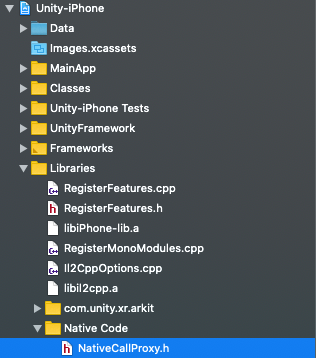
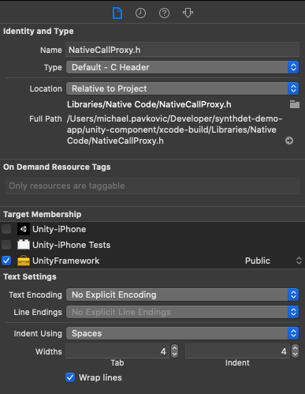

# SynthDet Viewer App for iOS
Test your machine learning models generated with Unity SynthDet in real life using Unity SynthDet Viewer! This app uses your device’s camera to send a stream of pictures to your machine learning models. Host your machine learning models online, and point the app to your server. Bounding boxes will appear around everything your ML models detect. Capture, share, and export the results of your object detection.

This is an app for iPhone and iPad that displays results of object detection machine learning models in augmented reality. For AR, this app uses Unity AR Foundation. Bounding boxes of detected objects are added to points in the real world through AR. The app relies on a web API for prediction. In our demo, we use TorchServe to host our SynthDet model. The app consists of two parts: the Unity component and native iOS component. 

## Features
* Augmented Reality rendering of bounding boxes around your ML model's predictions
* Customizable experience with ability to change minimum prediction score, and easily editable model list
* Switch models in the Viewer live, for easy comparison in training between many models
* Capture, share, and export the results of your object detection

## Usage

| Section | Steps |
| ------- | ----- |
| Dependencies | TorchServe REST server: Host your SynthDet trained model using [perception-synthdet-torchserve](https://github.com/Unity-Technologies/perception-synthdet-torchserve). |
| Installation | <ul><li>Install the app from the [App Store]() (recommended), or</li><li> Build from source with the steps in [How to Build](https://github.com/Unity-Technologies/perception-synthdet-demo-app#how-to-build)</li></ul> |
| Run | <ol><li>Run the app, and tap on Settings in the top right corner. Tap Edit Models, and then Add Model Endpoint.</li><li>In the row for your new model endpoint, enter a name (this can be anything you want, something to remember the model by). Then, enter the URL where the app should send prediction requests. If you don't want to type in a long URL on your iOS device, feel free to use the `qr.sh` script in perception-synthdet-torchserve, which will generate QR codes for the model endpoints it exposes.</li><li>Tap Done Editing, then Done.</li><li>Select your model by tapping Choose Model at the bottom of your screen. If the button displays the name of one of your models, that model is selected.</li><li>Point your device at some groceries, and watch the boxes be drawn!</li></ol> |

### Button Functions
| Button | What it does | Where it is |
| ------ | ------------ | ----------- |
| Choose Model / {model name} | Tap to choose the active model | Bottom center of the main screen |
| Shutter Button | Circular button that takes a picture of the current image on screen, and saves a COCO export of the scene as well, for data analysis | On the middle right side of the screen |
| Share Captures | Shares a folder of all captures taken with the Shutter Button. This uses the iOS Share Sheet, so you can share your captures like normal photos on iOS, sending them via AirDrop, Google Drive, email, text, etc | Settings screen |
| Delete All Captures | Deletes all captures taken | Settings screen |
| QR | Reads current camera image for QR codes; if it finds one, places the text in the URL box next to it | Settings screen, on each model row |

## How to Build
You will need a Mac with Xcode 11.5 or later, and Unity 2019.3.14f1 or later. The app is available on the [App Store](), so we recommend installing it that way.
 

Before building, make sure your Unity installation has the iOS Build Support module installed. In Unity Hub, click on the three vertical dots in the top right of your chosen installation in the Installs menu. Click Add Modules, select iOS Build Support, and click Done. Wait while the install finishes.
 

1. Open the Unity project. In Unity Hub, select Projects and then Add. Navigate to where you cloned this repository, and add the unity-component folder as a project.
2. Build the Unity component by clicking File and then Build for iOS.
3. Open the project in Xcode by opening synthdet-demo-app.xcworkspace.
4. Click on _native-app_ with the blue Xcode file icon in the Project navigator (the pane to the left of the Xcode window).
 

5. Click on the _native-app_ target, and select Signing & Capabilities.
 

6. Check Automatically manage signing if you are using your own Apple ID to sign the app. The Team should be capable of code signing to run on a real iOS device (this app will not work in the Simulator). Any free or paid Apple Developer account can be used for the Team. The Bundle Identifier can be set to any string that is not in use as a bundle identifier already.
7. In the Project navigator on the left, select Unity-iPhone/Libraries/Native Code/NativeCallProxy.h. 
 

8. On the right side of the Xcode window, make sure UnityFramework is checked, and change the dropdown next to it from Project to Public.
 

9. In the Project navigator on the left, select Unity-iPhone/Data, and like step 8, make sure UnityFramework is checked.

10. Make sure your iOS device is plugged in, and build the _native-app_ scheme in Xcode by selecing it in the top-left corner, and selecting the iOS device as the destination. Then click the play button. You will have to let your device trust the Mac it is plugged into if it is the first time using your iOS device on your Mac. 

### After build and install
You will only have to do this after the first install of the app. On your iOS device, open Settings. Tap General and then Device Management. You should see a profile with your Apple ID's email address (or another name if you made your own signing certificate and provisioning profile). Tap on it, and tap Trust. 
