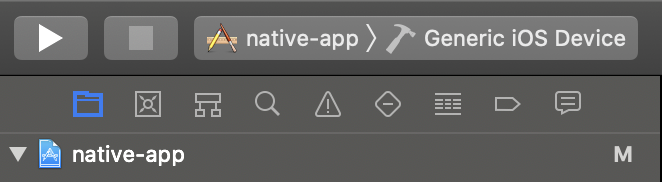
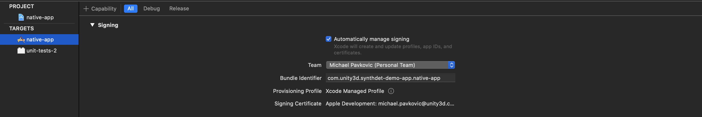
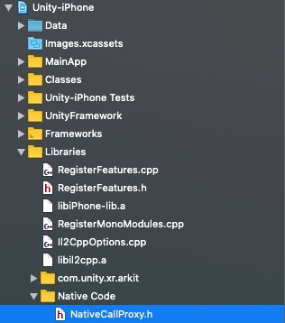
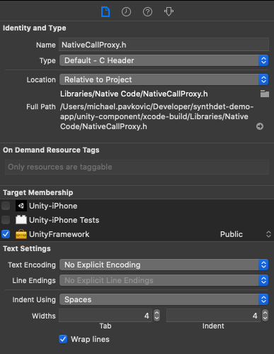

## How to Build
You will need a Mac with Xcode 11.5 or later, and Unity 2019.3.14f1 or later. The app is available on the [App Store](), so we recommend installing it that way.
 

Before building, make sure your Unity installation has the iOS Build Support module installed. In Unity Hub, click on the three vertical dots in the top right of your chosen installation in the Installs menu. Click Add Modules, select iOS Build Support, and click Done. Wait while the install finishes.
 

1. Open the Unity project. In Unity Hub, select Projects and then Add. Navigate to where you cloned this repository, and add the unity-component folder as a project.
2. Build the Unity component by clicking File and then Build for iOS.
3. Open the project in Xcode by opening synthdet-demo-app.xcworkspace.
4. Click on _native-app_ with the blue Xcode file icon in the Project navigator (the pane to the left of the Xcode window).
 

5. Click on the _native-app_ target, and select Signing & Capabilities.
 

6. Check Automatically manage signing if you are using your own Apple ID to sign the app. The Team should be capable of code signing to run on a real iOS device (this app will not work in the Simulator). Any free or paid Apple Developer account can be used for the Team. The Bundle Identifier can be set to any string that is not in use as a bundle identifier already.
7. In the Project navigator on the left, select Unity-iPhone/Libraries/Native Code/NativeCallProxy.h. 
 

8. On the right side of the Xcode window, make sure UnityFramework is checked, and change the dropdown next to it from Project to Public.
 

9. In the Project navigator on the left, select Unity-iPhone/Data, and like step 8, make sure UnityFramework is checked.

10. Make sure your iOS device is plugged in, and build the _native-app_ scheme in Xcode by selecing it in the top-left corner, and selecting the iOS device as the destination. Then click the play button. You will have to let your device trust the Mac it is plugged into if it is the first time using your iOS device on your Mac. 

### After build and install
You will only have to do this after the first install of the app. On your iOS device, open Settings. Tap General and then Device Management. You should see a profile with your Apple ID's email address (or another name if you made your own signing certificate and provisioning profile). Tap on it, and tap Trust. 
